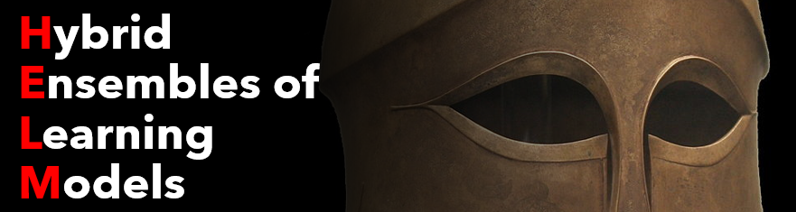
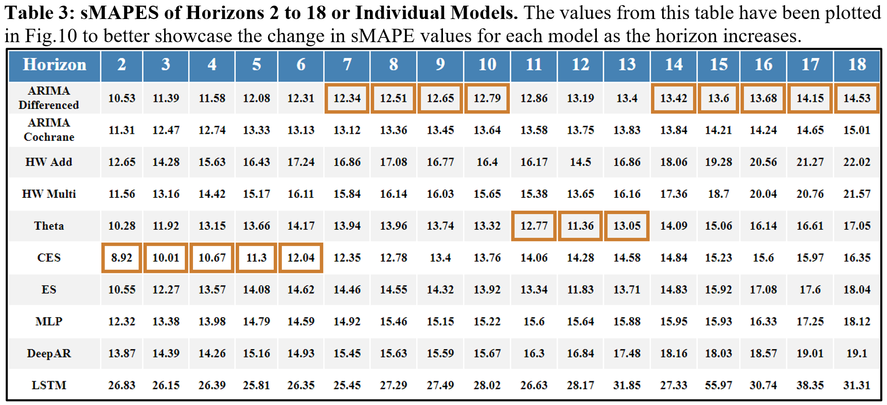
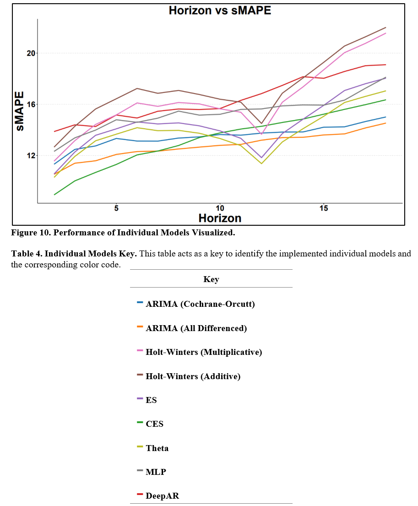
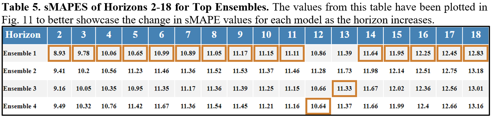
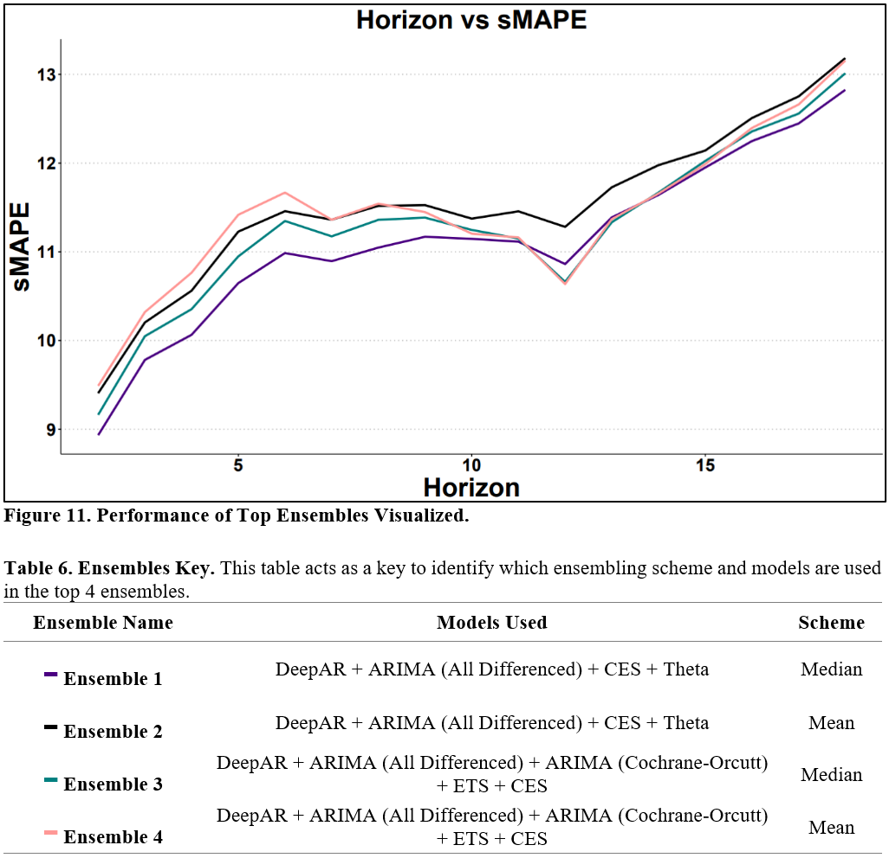
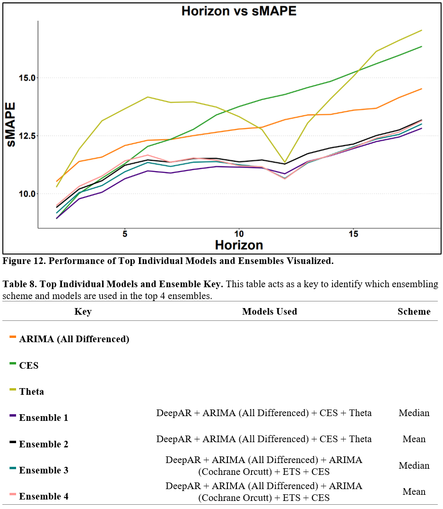
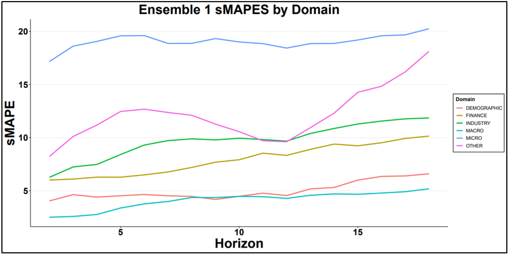

Badge [source](https://shields.io/)

# Key findings: Ensembling forecasts with multiple statistical and deep learning models using median or mean schemes leads to better performance across all forecasting horizons.

## Authors

- [@tiddles585](https://github.com/tiddles585)
- [@duynlq](https://github.com/duynlq)

## Table of Contents

  - [Business Problem](#business-problem)
  - [Data Source](#data-source)
  - [Methods](#methods)
  - [Tech Stack](#tech-stack)
  - [Quick glance at the results](#quick-glance-at-the-results)
  - [Limitation and what can be improved](#limitation-and-what-can-be-improved)
  - [Repository Structure](#repository-structure)

## Problem Statement

Statistical forecasting models can be useful for capturing linear relationships in time series realizations; however, they often rely on certain distribution assumptions and struggle to capture more complex relationships in the time series data. Additionally, statistical models are known to be sensitive to outliers which produce forecasts that may misrepresent the data. 

Deep learning models, on the other hand, can handle difficult pre-modeling problems such as multiple seasonal components, missing data, and non-linear trends; however they require more computational power, more time and resources put into tuning, as well as higher understanding of the data in order to execute them properly.

By using ensembles that combine the satisfactory forecasts of multiple models, the forecasting accuracy can be improved even further. This research aims to ensemble various high-performing statistical and deep learning models to potentially achieve greater forecasting ability.

## Data Source

- [M3-Competition](https://forecasters.org/resources/time-series-data/m3-competition/)

## Methods

- ARIMA (differencing all realizations)
- ARIMA (differencing via Cochrane–Orcutt estimation)
- Holt-Winter's Additive
- Holt-Winter's Multiplicative
- [Theta](https://www.sciencedirect.com/science/article/abs/pii/S0169207000000662)
- [CES](https://onlinelibrary.wiley.com/doi/full/10.1002/nav.22074) (complex exponential smoothing)
- [ES](https://www.sciencedirect.com/science/article/abs/pii/S0169207001001108) (exponential smoothing state space model)
- [MLP](https://kourentzes.com/forecasting/2019/01/16/tutorial-for-the-nnfor-r-package/)
- [DeepAR](https://www.sciencedirect.com/science/article/pii/S0169207019301888)
- [LSTM](https://doi.org/10.1162/neco.1997.9.8.1735)
  
## Tech Stack
- R (refer to [here](https://github.com/tiddles585/Capstone/blob/duy_branch/R/Functions.R) for the libraries used)
- Python (used to implement LSTM and DeepAR)

## Quick glance at the results

Correlation between the features.

Confusion matrix of gradient boosting classifier.

ROC curve of gradient boosting classifier.

Top method

